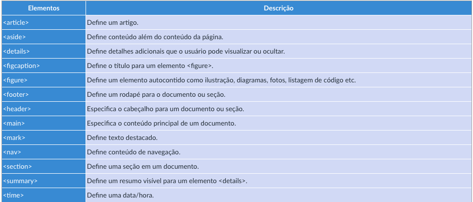
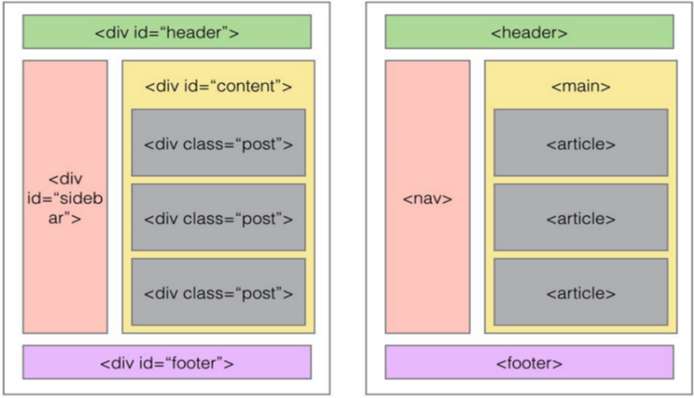
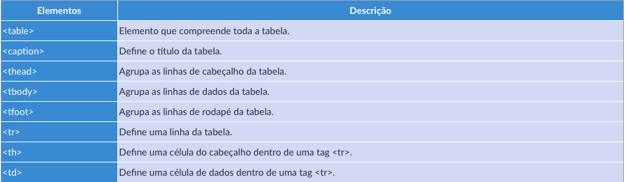
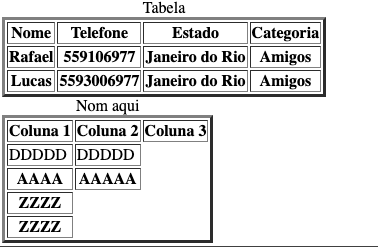

# Microfundamento: Desenvolvimento Web Front-End

## UNIDADE 1: A WEB, EVOLUÇÃO, PADRÕES E ARQUITETURAS

### TEMA 1: Fundamentos da WEB

#### Histórico e evolução 
* [A histório do Front-End para iniciantes em Programação](https://youtu.be/VKmPGmFY7H4?si=n_rTu3V_d_6fSklL) por Fabio Akita

* [A história dos buscadores de internet! – História da Tecnologia](https://youtu.be/zrV3C1DKWiI?si=F8Y-1VYxndACrsyx) Por TecMundo


#### W3C e os Padrões Web
O World Wide Web consortium (W3C) é um organização que desenvolve e estabelece padrões aberto para World Wide Web.

O processo de padronização realizado pelo W3C é simular com as RFCs, alguns padrões mantidos pelo W3C:

- Design e Aplicações Web (HTML, CSS, SVG, AJax, Acessibilidade)
- Arquitetura da Web (Protocolo HTTP, URI)
- Web Semântica (linked Data - RDF, OWL, SPARQL)
- Tecnologia XML (XML, XML Schema, XSLT)
- Navegadores e ferramentas de autoria.

Para testar compartibilidade do navegador com os padrões WEB, Teste Acid 3 - http://acid3.acidtests.org

Estágios do desenvolvimento de padrões pela WEC
- Working Draft (WD);
- Candidate release (CR);
- Proposed Recomendation (PR);
- Recomendation(REC).


### TEMA 2: Arquitetura Web

#### Componentes da Arquitetura Web e URI, URL e URN
* Ambiente do cliente
        
    Web browser, também conhecido como *user-agent*. Se comunica com servidor Web via HTTP(s)

* Ambiente servidor

    Servidor Web recebe processo e responder solicitações HTTP(s), interpreta a URL e retorna com o
    o recurso solicitada (Arquivo HTML, CSS, JavaScript, Imagens, Vídeos, folhas de estilo) pela Rede.

* Rede
    Meio por qual a(s) rede(s) conecta o cliente ao servidor por meio do protocolo IPv4/IPv6.
    DNS é um serviço de rede primordial de rede para traduzir endereços IP em nomes.

* URI, URL, e URN

    * **URI** (Uniform Resource Identifier): Padrão para endereçamento de recursos de rede que engloba
    ambos conceitos de URL (Uniform Resource locator) e URN Uniform Resource name.

[Wikipedia Uniform Resource Identifier](https://en.wikipedia.org/wiki/Uniform_Resource_Identifier)


* **URL** (Uniform Resource Lecator) É um padrão de URI que serce para referenciar um recurso e sua localização
composto das seguintes partes:
    
    * Esquema - Identifica o protocol entre cliente e servidor. Ex.: HTTP, HTTPS, FTP, SFTP, etc;
    * user:pass - identifica usuário e senha separado por ":";  
    * Porta - Identifica porta TCP/IP associada ao serviço. Ex.: HTTP (80);
    * Caminho - Indica o local exato onde o recurso se encontra;
    * Query - Dados não hierárquicos, detalhando a consulta normalmente sob a forma de chave=valor indicado por "?".
    Diferentes parametros são separados por "&";
    * Fragmento - Identifica uma seção do recurso.
    * Exemplo: **https://pucminas.com.br:80/admin/index.php?z1=w1&z2=w2**
    
    

* **URN** (Uniform Resource Name) é um padrão URI que serve identificar um recurso (NSS) pelo nome em um determinado amespace (NID). Ou seja, identifica um recurso sem específicar sua localização.
    
    * Exemplo de urn para identificar livro - **urn:isbn:978-1-491-91866-1**
    * NID - NameSpace Identifier
    * NSS - NameSpace Specific String


    

[Identificando recursos Web por Developer Mozilla](https://developer.mozilla.org/pt-BR/docs/orphaned/Web/HTTP/Basics_of_HTTP/Identifying_resources_on_the_Web)

#

#### Protocolo HTTP

> O HyperText Transfer Protocol (HTTP) é um protocolo da camada de aplicação para sistemas distribuídos de informação no formato hipertextos. 

*RFC-2068*

O protocolo HTTP é mantido pela W3C e possuí variadas versões, sendo a versão 2.0 a mais utilizad pelos 
clientes e servidores do mercados. Abaixo, uma imagem com versões do protocolo.


As interações entre cliente em servidor são compostas por  requisição HTTP (cliente) e respostas HTTP (servidor).
Essas interação contêm um formato de mensagem divido em três partes:

**Cliente**
* **Linha de requisição:** informa o método da requisição, o recurso e a versão do HTTP;
* **Linhas de cabeçalho:** Inclui informações complementares sobre a requisição no formato *chave:valor* para cada linha;
* **Corpo da entidade:** Carrega dados adicionais pessadas pelo cliente, tais como: Dados de formulários, arquivos completos
    em um processo de upload, entre outros.

```http
POST /app/processamento HTTP/1.1

User-Agent: Mozilla/4.0 (Compatible...)
Host: www.pucminas.br
Content-Type: text/xml; charset=utf-8
Content-Length: 88
Accept-Language: en-us
Connection: Keep-Alive

<?xml version=1.0> encoding="utf-8"?>
<string?>Conteúdo do arquivo</string>
```

É possível ver, que na requisição em específico a método POST foi utilizado. Além do POST, alguns outros métodos existem para realizar o CRUD (Create, Read, Update, and Delete).

* **GET** - Requisitar a representação de um recurso específico;
* **POST** - Enviar dados a serem processos por um recursos. Usado para incluir recursos ou submeter dados de processamento;
* **HEAD** - Similar ao GET, porém o retorno deve ser somente do conjunto de cabeçalhos associados ao recurso solicitado;
* **PUT** - Requisitar a criação ou atualização de um recurso no servidor a partir dos dados no corpo da rquisição; 
* **DELETE** - Excluir um recurso do servidor;
* **TRACE** - Solicita ao servidor uma cópia (eco) da requisição. Usado para testar se a requisição foi alterada no caminho;
* **PATCH** - Utilizado para realizar alterações parciais de um recurso;
* **OPTIONS** - Usado pelo cliente para entender, ou descobrir, os métodos HTTP e outras opções suportadas por um servidor Web;
* **CONNECT** - Usado quando o cliente estabelece uma conexão HTTPS com um servidor via um Proxy.


**Servidor**
* **Linha de reposta:** - Contém versão do HTTP, código de status e mensagem de status
* **Linhas de Cabeçalhos:** - Inclu informação complementares da respota no formato *chave:valor* por linha;
* **Corpo da entidade:** - Traz o recurso solicitado pelo cliente ou dados de respota à requisição feita.

```http
HTTP/1.1 200 OK

Date: Mon, 27 Jul 2009 12:28:53 GMT
Server: Apache/2.2.14 (Win32)
Last-Modified: Wed, 22 Jul 2009 19:15:56 GMT
ETag: "34aa387-d-1568eb00""
Content-Length: 88
Content-Type: text/html
Connection: Closed

<html><body>
<h1>Request Processed Successfully</h1>
</body></html>

```

O campo *Content-Type* informa o formato que o conteúdo enviado. Podendo ser texto, imagem, audio, video e aplicação como application/xhtml+xml, application/vnd.mspowerpoint, application/pdf, entre outros.

Para maior detalhes sobre tipo de dados, [MIME Type](https://developer.mozilla.org/pt-BR/docs/Web/HTTP/Guides/MIME_types) por Developer Mozilla.

* **[Visão geral do HTTP](https://developer.mozilla.org/pt-BR/docs/Web/HTTP/Guides/Overview)** por Developer Mozilla

#

#### Servidor Web
 Servidor Web, é a aplicação que responde as solicitações Web por hospedar um ou alguns Sites. Segue abaixo tarefas do servidor Web:

 - Atender requisições HTTP e processar repostas;
 - Gerenciar múltiplos sites (Domínios, IPs e Portas);
 - Gerenciar arquivos dos sites (sistema de arquivos);
 - Integrar com mecanismo de scripts: PHP, PERL, ASPX, Ruby, Python, etc.
 - Autenticar usuários
    
    - Autenticação básica ou digest (Protocolo HTTP);
    - Integração com servidores de autenticação (Microsoft Active Directory, LDAP Servers, Radius Servers).
- Implementar criptografia na comunicação: HTTPS - TLS/SSL;
- Cache de recursos;
- Auditoria (Logs de acesso, sistema e errors).    

[O que é um servidor Web (Web Server)?](https://developer.mozilla.org/pt-BR/docs/Learn_web_development/Howto/Web_mechanics/What_is_a_web_server) por Developer Mozilla

##### SOFTWARE E PROVEDORES
- Apache HTTP Server | Apache Web Server
    
    - [Apache](https://httpd.apache.org)
    - [XAMPP - Apache + MariaDB + PHP + Perl](https://www.apachefriends.org)
- Microsoft Internet Information Server (IIS) - Aplicações WEB em platforma .NET e hospedar sites estáticos.

- Servidores de Nuvem (Cloud Computing)

    - [Microsoft Azure](https://azure.microsoft.com/en-gb/)
    - [Heroku](https://www.heroku.com)
    - [Amazon AWS](https://aws.amazon.com/pt/)

- Editores Online 

    - Repl.it
    - [CodeSandBox](https://codesandbox.io)
    - [Glitch](https://glitch.com)

- Outras opções

    - GitHub Pages

#
#### Dinâmica de aplicações WEB
A comunição entre o browser e o servidor Web segue alguns passos para que o site requisito seja renderizado a apresentado.


1. Usuário informa a URL no Navegador;
2. O cliente DNS solicitada a resolução de novo ao servidor DNS;
3. O servidor DNS realiza a resolução e devolve para o cliente;
4. O cleinte solicita o arquivo index.html para o navegador;
5. O navegador identifica o link do HTML que com  o arquivo style.css e solicita este arquivo ao servidor;
6. O servidor encaminha o arquivo style.css para o navegador;
7. O Navegador identifica o link do HTML com o arquivo app.js e solicita este arquivo ao Servidor.
8. O Servidor encaminha o arquivo app.js para o Navegador.
9. O Navegador identifica o link do HTML com o arquivo logo.jpg e solicita este arquivo ao Servidor.
10. O Servidor encaminha o arquivo logo.jpg para o Navegador.
11. O Navegador apresenta a página para o Usuário

**Exemplo de estrura de página HTML**


Recurso adicionais por Developer Mozilla:

[Introdução ao CSS](https://developer.mozilla.org/pt-BR/docs/Learn_web_development/Core/Structuring_content)

[Como funciona CSS](https://developer.mozilla.org/pt-BR/docs/Learn_web_development/Core/Styling_basics/What_is_CSS)

## UNIDADE 2: DESENVOLVIMENTO DE INTERFACES WEB

### TEMA 1: Linguagem HTML

#### Linguagem HTML


A primeira versão da linguagem HTML foi lançada em 1991 por Tim Berners-Lee, baseada no padrão _standard Generalized Markup Language (SGML)_. Com o advento do HTML diversas versões surgiram assim como novas tecnologias foram criadas para melhorar e acompanhar essa evolução como CSS (Cascading Style Sheet) e JavaScript.

- CSS Permite formatar o conteúdo descrito no HTML
- JavaScript permite manipulação dos elementos da página e criar dinanismo no conteúdo propagado pela WEB
        
    - Ex.: Realizar cálculos, criar animações e validar formulários antes de submeter os dados ao servidor. 

O HTML ou _HyperText Mnarkup Language_ é a linguagem de marcação baseada em _tags_, utilizada para produção de documentos ou páginas Web.

**SINTAXE DA LINGUAGEM HTML**

Recurso recomendado: [w3schools HTML Tutorial](https://www.w3schools.com/html/html_intro.asp)

Os tags de marção no HTML contêm seus valos dentro de "< >". Algumas campos mais comuns incluem:

- **\<!DOCTYPE html>** - Informa a versão do HTML sendo a HTML5 em questão;

    - Exemplo de outras versões do html, para mais detelhe  _[we.org Recommend list of Doctyp declarations](https://www.w3.org/QA/2002/04/valid-dtd-list.html)_.
        
        - HTML 4.01 \<!DOCTYPE HTML PUBLIC "-//W3C//DTD HTML 4.01 Transitional//EN" "http://www.w3.org/TR/html4/loose.dtd">
        - XHTML1.0 \<!DOCTYPE html PUBLIC "-//W3C//DTD XHTML 1.0 Transitional//EN" "http://www.w3.org/TR/xhtml1/DTD/xhtml1-transitional.dtd">

- **\<html>  \</html>** - Representa o documento;
- **\<head> </head>** - Representa o cabeçalho, que contêm as configurações da página como metadados, referências de scripts e referência para códigos CSS (style.css); 

- **\<body> \</body>** - Corpo, conteúdo vusível da página;
- **\<-- Comentário -->** - Essa é a maneira de adicionar comentário em código HTML.

```html
<!DOCTYPE html>
<html lang="pt-br">
    <head>
        <meta name="author" content="Rafael">       
    </head>
    <body>
        <!-- Apenaws um comentário no código HTML -->
        <h1> Título </h1>
        <p> Parágrafo </p>
    </body>
</html>
```

Exemplo de cabeçalho _head_ com mais informação de metadados e referência ao arquivo CSS:

```html
<head>
    <title>Página de exemplo</title>
    <meta name="description" content="Rafael PUC Minas Web Site">
    <meta name="author" content="Rafael">
    <meta name="keywords" content="html, web, css">
    <link rel="stylesheet" href="style.css">
</head>
```

**TIPOS DE ELEMENTOS vs FUNÇÃO**
- **METADADOS**: Informações sobre a página;
    
    - \<tile>\</title>: Título do documento;
    - \<style>: Define código de formatação no padrão CSS;
    - \<link>: Definem ligações com outros arquivos comno: CSS, scripts, etc;
    - \<meta>: As meta tags trazem informações sobre o documento tais como codificação de caractreres, descrição, palavras-chaves, autor, etc.

```html
<head>
    <title>Exemp. Elementos de metadados</title>
    <meta name="description" content="Rafael PUC Minas Web Site">
    <meta name="author" content="Rafael">
    <meta name="keywords" content="html, web, css">
    <meta http-equiv="content-type" content="text/html; chatset=UTF-8" /> # Descreve MIME
    <meta http-equiv="expires" content="Mon, 30 sep 2026 11:12:00 GNMT" /> # Conteúdo consido expirado em
    <meta http-equiv="refresh" content="15; url="https://www.pucminas.br" /> # Riderencio após 15sec
    <meta http-equiv="cache-control" content="no-chace; public; private; no-store"> # Controle de salvamento da página clie ou proxy
    <link rel="stylesheet" href="style.css">
</head>
```
- http-eqiv sao equivalenta aos cabelos de resposta do HTTP.

#### Tipos de elementos e função

- **TEXTUAIS**: Conteúdo de texto das páginas;
- **MULTIMÍDIA**: Recursos como imagens áudio e vídeo;
- **TABELAS**: Estrutura de dados em tabelas;
- **ESTRUTURA**: Separação e organização do conteúdo;
- **FORMULÁRII**: Elementso para entrada de dados pelo usuário;
- **SCRIPTING**: Conteúdo dinâmico de aplicações Web;
- **INTEGRAÇÃO**: Conteúdo externo ou multimedia avançada.

#### Elementos de texto e multimedia
```html
Elementos	                Tags
-----------------------------------------------------------------------------
Títulos	                    <h1> .. </h1>, <h2> .. </h2>, ... , <h6> ...</h6>
Parágrafo	                <p> .. </p>
Quebra de Linha	            <br>
Voz alternativa (itálico)	<i> .. </i>
Palavra-chave (negrito)	    <b> .. </b>
Importância	                <strong> .. </strong>
Código-fonte ou programas	<code> ... </code>
Texto pre-formatado	        <pre> ... </pre>
Citações	                <blockquote> .. </blockquote>
<!-- Imagens GIF, JPG e PNG --> 

<!-- Links -->
 <a></a>
```

```html
<h1> Título 1 </h1>
<p> Este é um simples paragrafo de texto</p>

<h2> Título 2 </h2>
<!-- Quebra de linha -->
<p>Este é um simples parágrafo de texto <br /> com duas linhas </p>
```


Para maiores opções de semânticas https://www.w3.org/TR/2014/REC-html5-20141028/text-level-semantics.html#usage-summary

##### Listas e Imagens

```html
Ordenada   <ol> ... </ol>
Não ordenada <ul>...</ul>
Definições <dl>...</dl>
```

**Exemplo**


```html
<ol>
    <li> Primeiro item</li>
    <li> Segunddo item</li>
    <li> Terceiro item</li>
    <ul> A</ul>
    <ul> B</ul>
    <ul> C</ul>
    <dl> X </dl>
    <dl> Y </dl>
    <dl> Z </dl>
<dl> 
  <dt> termo 01</dt>
  <dd> definição 01</dd>
  <dt> <em>termo 02</em></dt>
  <dd> definição 02</dd>
</dl>
</ol>

```
#### Links
Links refereciam conteúdos em sites diferentes ou no mesmo site.

```html
  <a href="http://pucminas.br" target="_blank"> PUC Minas Web Site
</a>
```
Atribuido target define one o documento apontado pelo link será aberto e aceitos os valores:
- **_blank** – para nova janela ou tab,
- **_self** – para a mesma janela – default,
- **_parent** – para a o frame pai,
- **_top** – para a janela atual inteira ou
- **nome_do_frame** – para um frame específico.

##### Estrutura
No HTML 4.1 o as tags \<div>\</div> eram utilizadas para agrupar parte do conteúdo de uma página HTML com propósito genético de acordo com o critério do desenvolvedor.

Já no HTML, foram criadas tags específicas para o tipo de agrupamento.



Comparação entre HTML4.1 e HTML5



##### Tabelas
Recursos de referência para criação de tabelas:
- https://htmlreference.io/tables/
- https://developer.mozilla.org/en-US/docs/Web/HTML/Reference/Elements/table



Exemplo de tabela 
```html
<table border="3">
    <caption> Tabela </caption>
        <thead>
            <tr>
            <!-- COLUNAS -->
                <th>Nome</th>
                <th>Telefone</th>
                <th>Estado</th>
                <th>Categoria</th>
            </tr>
        </thead>
   
    <thead>
            <tr>
         <!-- LINHA 1 CADA ELEMENTO POR COLUNA -->
        <th>Rafael</th>
        <th>559106977</th>
        <th>Janeiro do Rio</th>
        <th>Amigos</th>
            </tr>
    </thead>
    <tr>
        <!-- LINHA 1 CADA ELEMENTO POR COLUNA -->
        <th>Lucas</th>
        <th>5593006977</th>
        <th>Janeiro do Rio</th>
        <th>Amigos</th>

    </tr>
</table>

<table border="3">
    <caption> Nom aqui </caption>
    <thead>
        <tr>
            <th>Coluna 1</th>
            <th> Coluna 2</th>
            <th>Coluna 3</th>
        </tr>
    </thead>
        <tr>
            <td>DDDDD</td>
            <td>DDDDD</td>
        </tr>
        <tr>
            <th>AAAA</th>
            <th>AAAAA</th>
        </tr>
        <tr>
            <th>ZZZZ</th>
        </tr>
            <th>ZZZZ</th>
        </tr>
    <tbody>
    </tbody>
</table>
```


##### Elementros de formulário

 Exemplo de códido e o o resultado
```html
<form nome="form_login" action="do_login.html" method="POST">
    Usuário: <input type="text" name="usuario" value=""><br>
    Senha: <input type="password" name="senha" value=""><br>
    <input type="submit" value="ok">
</form>
```

<form nome="form_login" action="do_login.html" method="POST">
    Usuário: <input type="text" name="usuario" value=""><br>
    Senha:   <input type="password" name="senha" value=""><br>
    <input type="submit" value="ok">
</form>
